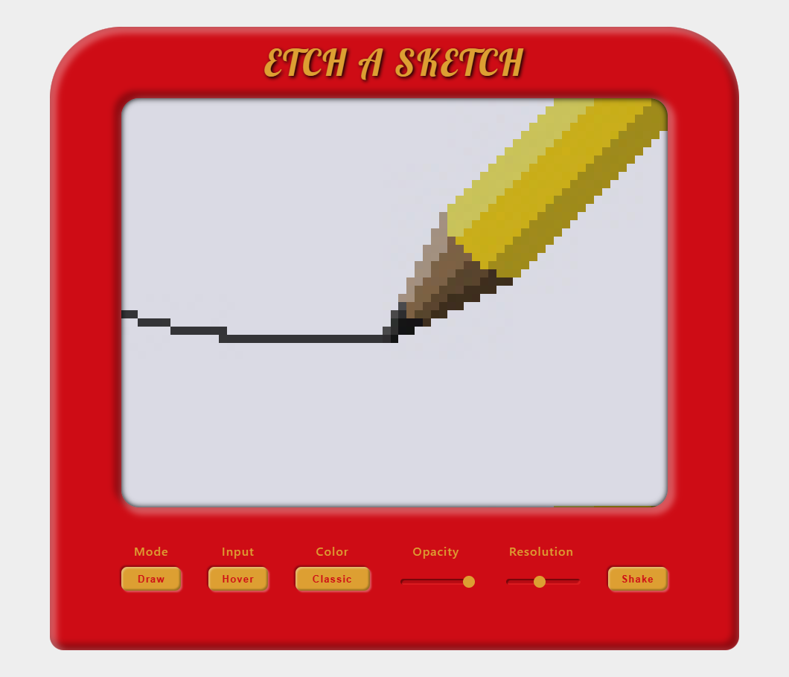

# Etch-a-sketch

This is my entry for [The Odin Project](https://www.theodinproject.com/)'s Etch-A-Sketch project.
[Link to the Assignment](https://www.theodinproject.com/paths/foundations/courses/foundations/lessons/rock-paper-scissors).  
Made with HTML, CSS and JS.

## Preview:

-   Experiment with the live version [here](https://madmaia3d.github.io/odin-etch-a-sketch/).

## Features:

-   **Draw** or **Erase** pixels either by **Clicking** or **Hovering**.
-   **8 Color** Modes:
    -   Classic (dark gray)
    -   Custom Color
    -   Random Rainbow Color
    -   Rainbow Gradient
    -   Random Warm Color
    -   Warm Gradient
    -   Random Cold Color
    -   Cold Gradient
-   **Opacity** Slider.
-   Select between 10 **Resolution**s, from 10p to 100p.
-   **Erase** the canvas.

## Feature ideas that can be implement in the future:

-   Dark mode.
-   Any randomized color.
-   Any color gradient.
-   Option for background brightness.
-   Show/Hide Grid option.
-   Option for more aspect ratios.
-   Change the canvas implementation from flexbox to grid.
-   Save the last drawing in the local storage.
-   Option to save more than one drawing.
-   Option to export the image.

## Tools used:

-   Visual Studio Code
-   Git + GitHub
-   Git Bash for terminal commands
-   Google's Chrome and Microsoft's Edge

## Thoughts:

Despite using flexbox for creating the grid structure of the canvas, it worked very well and come very fast.  
On the first day I already had a canvas that was paintable with one color, the device red frame around and the initial footer.

Then I had to fight with flexbox to arrange buttons and slider to get a result that I would be satisfied. At this stage I had trouble trying to understand how to style the range input, but got it to work very well. After that, the HTML and CSS were pretty much done, needing only minor tweaks.

Implementing the first two functionalities it was a breeze. Just two buttons to switch between draw and erase modes, and hover or click input.

The implementation of the opaque color despite not being so hard, it required many hours of thinking, especially the part of the gradients. When I got it to work, I noticed that I could reduce the number of functions for the color modes. It was 3 functions for random colors (rainbow, warm and cold) and 3 functions for gradients (also rainbow, warm and cold). I decide to refactor them and managed to reduce these 6 functions to only 3: 1 for all of the random colors, 1 for the warm and cold gradients, and 1 for the rainbow gradient. I think this was a great moment since the code got smaller and more reusable.

For the erase feature I included a shake animation to simulate the way that you would clean the canvas in the real device.

Despite the curriculum of The Odin Project giving only idea of an opacity mode that would work with black, I decided do make it work with any color, and that came as a very difficult challenge, since I had many problems of how HTML, CSS and JS, and even how the project is implemented, deals with color. I had to find on the internet ways to convert from different color systems, HSL, RGB and hexadecimal, including the string representation of them.  
This was the part of the project that gave me more work, but after finishing I was very proud of the result.

At last, the resolution selector functionality was implemented. To be honest it was practically done from the start since it's basically the same functions that create the canvas, I just made the functions to be called with the value selected by the user.

## Outcomes:

-   Got more practice with CSS flexbox and CSS in general.
-   Learned how to style the input range and input color elements.
-   Got more practice with DOM events.
-   Learned to use JS export and import to break the code into multiple files.
-   Practiced my problem solving skills.

---

This project is part of the [Odin Project](https://www.theodinproject.com/) curriculum.
